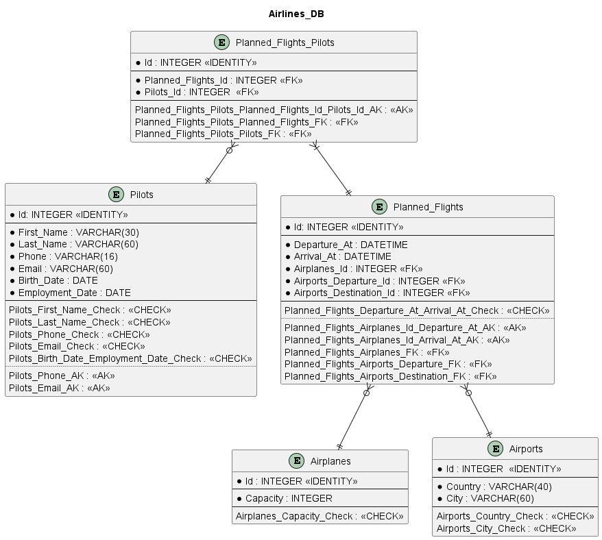

# insert_gen

Example project for generating insert SQL script using [PyPika](https://pypi.org/project/PyPika/) and [Faker](https://pypi.org/project/Faker/).

Syntax of generated script is compatible with [HSQLDB](http://hsqldb.org/) (version 1.8)

Database schema used in this project has the next tables:

`access_import` includes separate import files for each table, for importing the data into MS Access database.

